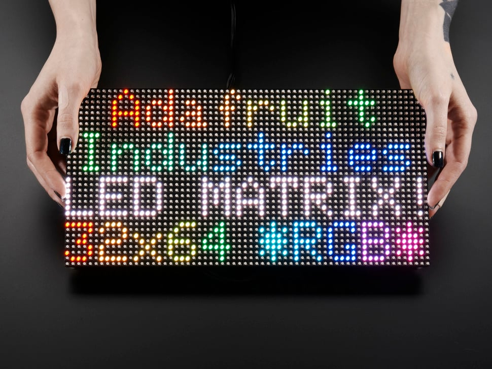

## Members
Yassin Lahrime
yassinl@vt.edu

## Repo Link
<a class="button is-link" href="https://github.com/7Spook7/BMOtrix/" >my bmo matrix</a>

## Photo

## Mentor
Ethan

## Current Status
Early stages of programming

## Project Overview

RGB LED MATRIX that will be housed within an adventure time BMO printed case. It will have buttons that will allow the user to navigate the menus between the various apps I end up programming onto the raspberry pi that sends signal to the LED Matrix Dashboard. This is mainly a programming project where I'm going to need to write a controller script for the RGB matrix with the help of a prewritten library to do some of the lower level heavy lifting but I'm still going to need to use a lot of api calls to get some of the spotify, time and weather functionality that I want to impliment into the board. 

## Educational Value Added

Will help me sharpen up my python skills and learn some entry level bash scripting and linux via the raspberry pi. Will also get some experience with CAD and 3D printing which I've never done before because I need to print a case to house all the components for the project. I'm also going to need to learn how to wire up the buttons to the pi so I can program them and use them to navigate the menus for the controller script that I end up writing.  

## Tasks

<!-- Your Text Here. See Example above -->

## Design Decisions

<!-- Your Text Here. See Example above -->

## Design Misc

<!-- Your Text Here. See Example above -->

## Steps for Documenting Your Design Process

<!-- Your Text Here. See Example above -->

## BOM + Component Cost

https://www.adafruit.com/product/1010?gclid=Cj0KCQjwusunBhCYARIsAFBsUP9fIcaiRtQUJRk5cn1uMaaynAJzMA9EhY9ZcrUHv6_4kcMgis1ogi0aAkS0EALw_wcB

## Useful Links

BOM

## Log

<!-- Your Text Here. See Example above -->